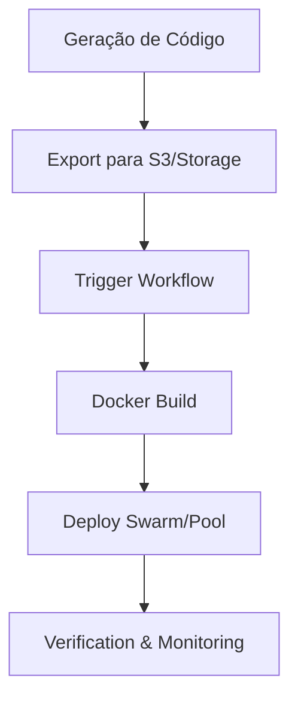

# Blueprint CI/CD - NodeBuilder Enterprise

Guia para implementar automação de deploy (Phase 3 Finalization).

## Fluxo de Deploy Automatizado



### 1. GitHub Actions (Exemplo)

Crie `.github/workflows/deploy-sandbox.yml`:

```yaml
name: Deploy Project Sandbox
on:
  repository_dispatch:
    types: [deploy_project]

jobs:
  build_and_deploy:
    runs-on: ubuntu-latest
    steps:
      - uses: actions/checkout@v4
      - name: Build Sandbox Image
        run: docker build -t nodebuilder/sandbox:${{ github.event.client_payload.project_id }} .
      - name: Deploy to Remote Swarm
        run: |
          docker stack deploy -c docker-compose.yml nb-stack-${{ github.event.client_payload.tenant_id }}
```

### 2. Monitoramento & Autoscaling (Phase 5)

- **Monitoramento**: Use `cadvisor` ou Prometheus para coletar métricas de CPU/RAM das sandboxes.
- **Autoscaling**: O `DockerService` deve ser notificado via Webhook quando o uso de portas atingir 80% do pool para provisionar um novo nó ou expandir o range.

### 3. Backup de Segurança

- Os backups gerados pelo `BackupService` devem ser enviados para um bucket S3 versionado diariamente.
- Script Recomendado: `bash scripts/upload-backups.sh`
